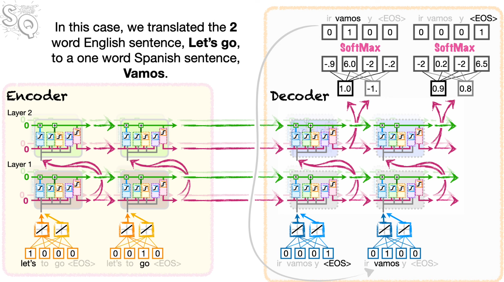

# PyTorch Seq2Seq

This repo contains train models to translate from German to English.

- For Nvidia GPU training, we may need to install `torch` for corresponding CUDA version, such as:

```bash
  # For CUDA 12.1
  pip install torch torchvision torchaudio --index-url https://download.pytorch.org/whl/cu121
  # 3. Verify installation in Python
  python -c "import torch; print(torch.cuda.is_available())"
```

```bash
  pip install -r requirements.txt
```

- Notes: `torchtext` is deprecated. It will require Python=3.11 at this moment, and it also require to install with `conda -c pytorch torchtext`, which will only work with CPU training.

## Getting Started

Install the required dependencies with: `pip install -r requirements.txt --upgrade`.

We'll also make use of [spaCy](https://spacy.io/) to tokenize our data which requires installing both the English and German models with:

```bash
python -m spacy download en_core_web_sm
python -m spacy download de_core_news_sm
```

## Example Architecture

- 2-Layer LSTM in Encoder, each layer with 2 LSTM cells
  
- Context Vector of 2 Long term memory cells, and 2 Short-term memory cells will be passed to Decoder
- Alternative: Decode the sequence from EOS backwards, or from SOS (Start of Sentence) forward.
- Alternatvie: Using `Teacher Forcing` to train Decoder, by using next known word, instead of predicted word

## References

Here are some things I looked at while making these tutorials. Some of it may be out of date.

- https://github.com/spro/practical-pytorch
- https://github.com/keon/seq2seq
- https://github.com/pengshuang/CNN-Seq2Seq
- https://github.com/pytorch/fairseq
- https://github.com/jadore801120/attention-is-all-you-need-pytorch
- http://nlp.seas.harvard.edu/2018/04/03/attention.html
- https://www.analyticsvidhya.com/blog/2019/06/understanding-transformers-nlp-state-of-the-art-models/
